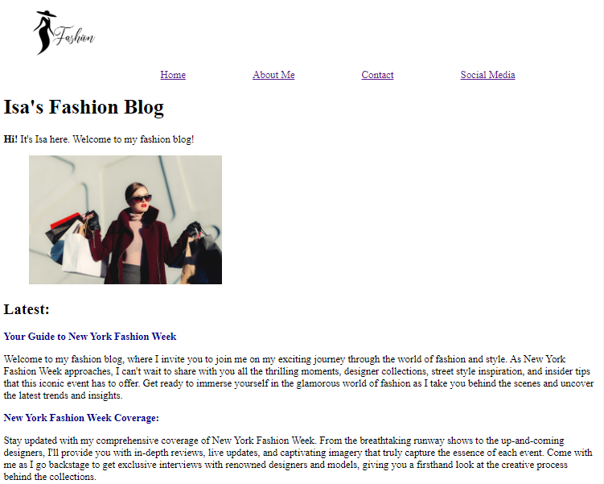

# Fashion Blog
Um projeto pessoal com foco em HTML e um pouquinho de CSS 🚀

## Tecnologias Utilizadas:
- HTML
- CSS

## Motivação
1 - Exercício proposto no curso de Front-End Engineer da CodeCademy

## Overview


<!-- ## Como utilizar o projeto
1 - Clone o projeto:
```
git clone <url>
```
2 - Acesse a pasta do projeto
```
cd repositorio-com-readme
``` -->